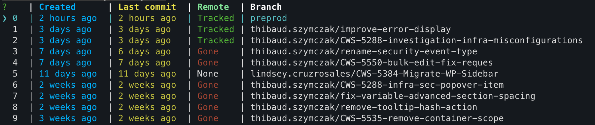

## Tips and tricks

### Rebase vs merge
In your global git config, configure `git pull` to use rebase vs merge. 

```text
# .gitconfig

[pull]
    rebase = true
```

### Use the terminal

Using the terminal has multiple advantages:
 - use it everywhere - you are not dependent on a specific environment/IDE
 - it is the most flexible way of using git - you are not limited by the restriction of a UI layer
 - extremely customizable (see sections below)
 - the best way to learn how git works

### Using aliases

#### git aliases
Use aliases to optimize your workflow. This can be done at a user level (`~/gitconfig`) or at a project level (`.git/config`). For example: 

 ```
 # .gitconfig
 
[alias]
   my = "log --grep=thibaud.szymczak@datadoghq.com"
 ```

To only log my changes. 

To pass arguments to the alias, you can set the alias to be a bash function: 

```text
# .gitconfig

[alias]
  create = "!f() { git checkout -b thibaud.szymczak/\"$1\";}; f"
```

`> git create feature-1` will create a branch called `thibaud.szymczak/feature-1`

#### Shell aliases

Shell aliases are a bit more flexible and are best suited when you want to chain commands. [ZSH already provides a lot out of them box](https://github.com/ohmyzsh/ohmyzsh/tree/master/plugins/git):

Enable with:

```text
.zshrc

  plugins=(git)
```

Here are mine: 

```shell
# Shorthand for git command
alias g="git"

# Remove any existing gco alias to avoid conflicts
unalias gco

# Checkout using ngit-cli tool
alias gco="ngit-cli checkout"

# Stage all changes and commit with a message
alias gcam="git add . && git commit -m"

# Pull from origin preprod branch
alias gpop="git pull origin preprod"

# Checkout preprod branch and pull latest changes
alias gcop="git checkout preprod && gpop"

# Quick work-in-progress commit bypassing pre-commit hooks
alias gcwip="git add . && git commit -m 'wip' --no-verify"

# Add all changes and amend to last commit without editing message
alias gane="git add . && git commit --amend --no-edit"

# Pull from origin for the current branch
alias gpb="git pull origin \$(git rev-parse --abbrev-ref HEAD)"
```

Making aliases is now easier than ever with AI. 

### Going further - build your own cli tool


Make git work the way you want!

[This is mine](https://github.com/thibaudszy/ngit-cli) - ngit-cli



### Do not use the terminal

Sometimes it is not the best tool for the job. These are (amongst others) the tasks for which I do not use the cli for: 

 - git conflict resolutions
 - checking diffs/changes
 - squashing commits
 - git blame
 - "dropping commits" ie removing one or more commits from the history

For these tasks, I find Webstorm to be very good

### use "-"

 Works similarly to `-` in the `cd` command. In git, this is a reference to the previous ref. For example: 

 - `git cherry-pick -` to cherry-pick the last commit you were on onto the current branch
 - `git rebase - ` to rebase the current branch on the previous ref. Generally used after switching branches

### Avoiding and dealing with conflicts (in web-ui)

#### Avoiding conflicts
 - keep your branches up to date (use the `gcop` and `gpop` aliases)
 - When working on stacked PRs, use a tool like graphite to sync the changes. Or do it manually but do not forget
 - Avoid long lived branches and big PRs. Prefer smaller changes and hide WIP features behind feature flags

### Dealing with conflicts

 - Conflicts in auto-generated files (generally) do not matter. Conflicts in `pnp.cjs` and `yarn.lock` should be resolved by accepting the changes from `preprod` (or the shared branch) and re-running `yarn` locally. 
 - Jetbrains IDEs have a good UI to resolve conflicts

### Speed up your git pulls

Add this line to your list of cronjobs:

```text
*/15 * * * * cd ~/dd/web-ui && git fetch origin preprod
```

This performs a fetch of preprod every 15 minutes

### Useful resources

Caveat: these are only the resources that I have used and have helped me. They only cover a small portion of git features (with the exception of the official docs).

 - [git docs](https://git-scm.com/docs) - duh
 - [Atlassian git docs](https://www.atlassian.com/git/tutorials) - less thorough than the official docs but made by people not allergic to CSS

 - [Oh my git](https://ohmygit.org/) - Git game to learn git interactively

 - [So you think you know git](https://www.youtube.com/watch?v=aolI_Rz0ZqY&pp=ygUSeW91IGRvbid0IGtub3cgZ2l0) - talk by the cofounder of github on advances and new(ish) git features
 - [So you think you know git - part 2](https://www.youtube.com/watch?v=Md44rcw13k4)
 - [13 Advanced (but useful) Git Techniques and Shortcuts](https://www.youtube.com/watch?v=ecK3EnyGD8o) - description is in the title of the video
